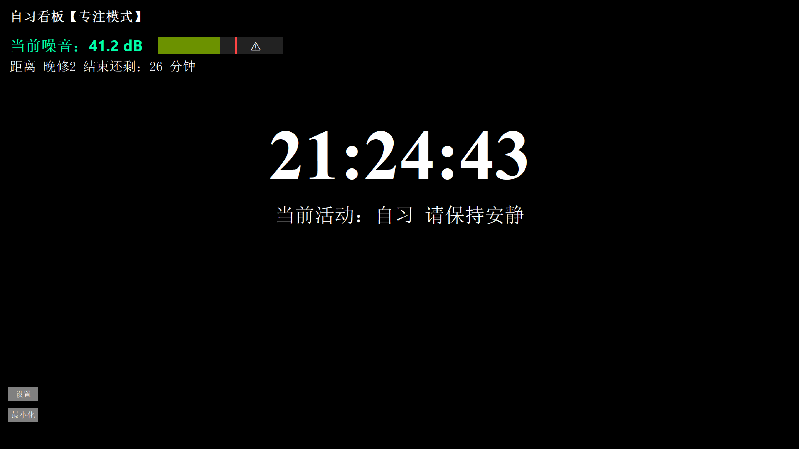

---

# 自习看板 SelfStudy Dashboard

#> 一个专注于自习室管理的可视化大屏程序，具备噪音检测、倒计时提醒和课程表同步功能。

[](https://www.gnu.org/licenses/gpl-3.0)  
[](https://github.com/lic06/Selfstudy_boards/releases/tag/v1.0.2)

## 📌 简介

这是一个为学校或学习场所设计的桌面应用程序，旨在提供一个沉浸式、专注模式下的自习课可视化大屏。项目使用 Python 编写，依赖 Tkinter 构建图形界面，并利用 SoundDevice 进行环境噪音监测与分析。

主要功能包括：

- 🔊 实时噪音检测（单位：分贝 dB）
- 🕒 全屏时间显示
- ⏳ 课程时间表倒计时
- 🎛️ 设备选择 & 噪音灵敏度调节
- 🧪 最小/最大基准线校准
- 🌗 深色 / 浅色模式切换
- 📤 系统通知 + 最小化逻辑
- 🛠️ 设置面板 + 关于页面

---

## 🧰 技术细节

| 项 目           | 内 容                              |
|----------------|-----------------------------------|
| 语言            | Python 3.x                        |
| GUI 框架        | Tkinter                           |
| 音频处理        | sounddevice, numpy, scipy         |
| 配置读取        | configparser                      |
| 系统通知支持    | plyer                             |
| 开源协议        | GNU General Public License v3.0   |
| 当前版本号      | 1.0.2                             |

---

## 🚀 快速开始

### 安装依赖

```bash
pip install numpy scipy sounddevice plyer tkinter configparser
```

### 获取项目

```bash
git clone https://github.com/lic06/Selfstudy_boards.git
cd Selfstudy_boards
```

### 启动程序

```bash
python main.py
```

---

## ⚙️ 配置说明

在项目根目录创建或修改 `schedule.json` 文件以定义课程时间表：

```json
[
  {"name": "第一节", "start": 1140, "end": 1230},
  {"name": "第二节", "start": 1245, "end": 1310}
]
```

> 时间格式为整数分钟数，格式为 `起始分钟-结束分钟`，例如：
- `1140 = 19 * 60`
- `1230 = 20 * 60 + 30`

默认值为 `[(1140, 1230), (1245, 1310)]`，若文件不存在则自动使用默认配置。

---

## 💡 主要功能模块

### 📣 噪音检测系统

- 实时监听麦克风输入
- 动态计算当前噪音强度（dB）
- 支持用户校准最小/最大基准线（用于归一化显示）

#### 使用方法：

进入设置 → 基准线校准 → 分别点击"校准最小基准线"和"校准最大基准线"

---

### ⏳ 倒计时提醒

- 根据当前时间匹配课程时间段
- 显示"距离时间段 N 结束还剩 X 分钟"
- 若无活动，则显示"无活动"

---

### 🎨 深色/浅色模式切换

点击设置窗口中的"切换深浅色模式"，即可切换整体界面配色风格。

---

### 🛠️ 设置面板

支持以下操作：

- 选择录音设备
- 调节噪音检测灵敏度
- 执行基准线校准
- 切换界面主题
- 打开关于页
- 保存配置并退出

---

## 🧩 程序结构

本项目由多个模块组成：

### 主要模块：

- [main.py](file://c:/Users/%E6%A2%81%E7%AB%8B%E5%BE%B7/Desktop/%E8%87%AA%E4%B9%A0%E7%9C%8B%E6%9D%BF%E9%87%8D%E6%9E%84/main.py) - 程序入口点
- [ui.py](file://c:/Users/%E6%A2%81%E7%AB%8B%E5%BE%B7/Desktop/%E8%87%AA%E4%B9%A0%E7%9C%8B%E6%9D%BF%E9%87%8D%E6%9E%84/ui.py) - 主界面和启动画面
- [noise_detector.py](file://c:/Users/%E6%A2%81%E7%AB%8B%E5%BE%B7/Desktop/%E8%87%AA%E4%B9%A0%E7%9C%8B%E6%9D%BF%E9%87%8D%E6%9E%84/noise_detector.py) - 噪音检测核心逻辑
- [settings_window.py](file://c:/Users/%E6%A2%81%E7%AB%8B%E5%BE%B7/Desktop/%E8%87%AA%E4%B9%A0%E7%9C%8B%E6%9D%BF%E9%87%8D%E6%9E%84/settings_window.py) - 设置窗口
- [about_window.py](file://c:/Users/%E6%A2%81%E7%AB%8B%E5%BE%B7/Desktop/%E8%87%AA%E4%B9%A0%E7%9C%8B%E6%9D%BF%E9%87%8D%E6%9E%84/about_window.py) - 关于窗口
- [activity_configurator.py](file://c:/Users/%E6%A2%81%E7%AB%8B%E5%BE%B7/Desktop/%E8%87%AA%E4%B9%A0%E7%9C%8B%E6%9D%BF%E9%87%8D%E6%9E%84/activity_configurator.py) - 活动配置器
- [config_loader.py](file://c:/Users/%E6%A2%81%E7%AB%8B%E5%BE%B7/Desktop/%E8%87%AA%E4%B9%A0%E7%9C%8B%E6%9D%BF%E9%87%8D%E6%9E%84/config_loader.py) - 配置加载器
- [shortcut.py](file://c:/Users/%E6%A2%81%E7%AB%8B%E5%BE%B7/Desktop/%E8%87%AA%E4%B9%A0%E7%9C%8B%E6%9D%BF%E9%87%8D%E6%9E%84/shortcut.py) - 快捷方式创建工具
- [readme_viewer.py](file://c:/Users/%E6%A2%81%E7%AB%8B%E5%BE%B7/Desktop/%E8%87%AA%E4%B9%A0%E7%9C%8B%E6%9D%BF%E9%87%8D%E6%9E%84/readme_viewer.py) - README查看器

---

## 📦 项目目录结构

```
Selfstudy_boards/
├── main.py                     # 程序入口
├── ui.py                       # 主界面UI
├── noise_detector.py           # 噪音检测模块
├── settings_window.py          # 设置窗口
├── about_window.py             # 关于窗口
├── activity_configurator.py    # 活动配置器
├── config_loader.py            # 配置加载器
├── shortcut.py                 # 快捷方式创建工具
├── readme_viewer.py            # README查看器
├── schedule.json               # 课程时间表配置文件
├── README.md                   # 本文件
└── screenshot.png              # 可选：运行截图
```

---

## ❓ 已知问题与注意事项

- macOS 用户首次运行可能需要授权访问麦克风。
- Windows 用户需确保隐私设置中允许应用使用麦克风。
- 初次使用建议进行一次完整的"最小/最大"基准线校准以提高准确性。
- 程序最小化后120秒自动恢复，可避免误操作关闭。

---

## 🧑‍💻 贡献指南

我们欢迎所有形式的贡献，包括但不限于：

- Bug Fix
- 功能增强
- 中文/英文文档完善
- 示例优化
- 新特性提案

请遵循如下流程参与：

1. Fork 仓库
2. 创建 feature 分支 (`git checkout -b feature/your-feature`)
3. 提交更改 (`git commit -m 'Add some feature'`)
4. Push 到远程分支 (`git push origin feature/your-feature`)
5. 提交 Pull Request

---

## 📬 联系开发者

如遇问题或有改进建议，请通过以下方式联系我们：

- 📧 Email: [9duoliang@gmail.com](mailto:9duoliang@gmail.com)
- 💬 GitHub Issues: [提交反馈](https://github.com/lic06/Selfstudy_boards/issues)

---

## 📄 开源许可

GNU General Public License v3.0

This program is free software: you can redistribute it and/or modify
it under the terms of the GNU General Public License as published by
the Free Software Foundation, either version 3 of the License, or
(at your option) any later version.

This program is distributed in the hope that it will be useful,
but WITHOUT ANY WARRANTY; without even the implied warranty of
MERCHANTABILITY or FITNESS FOR A PARTICULAR PURPOSE. See the
GNU General Public License for more details.

You should have received a copy of the GNU General Public License
along with this program. If not, see <https://www.gnu.org/licenses/>.

---

## 📸 截图预览




---